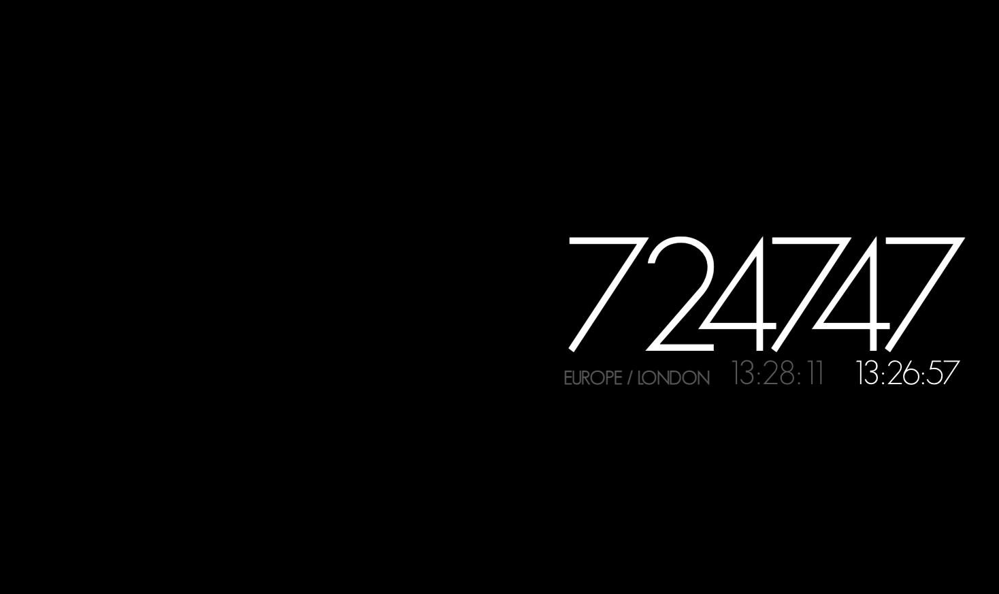

# Bitcoin Block Clock (v2 — Swift/macOS)

macOS screensaver powered by mempool.space 's awesome API. The original [Bitcoin Block Clock](https://raw.github.com/disuye/Bitcoin-Block-Clock) screensaver features a console style real-time data dump from Mempool. This Minimalist screensaver only shows block tip height, block timestamp, and local fiat time.

This saver requires an internet connection, otherwise nothing interesting is displayed.



## Info

Includes a tweaked version of [GeoSans Light](https://www.dafont.com/geo-sans-light.font) font, created by [Manfred Klein](https://www.fontzillion.com/fonts/manfred-klein/geo-sans-light). I had some kerning issues, so converted the TTF to WOFF2 using 'Font-face Generator' on Font Squirrel.

## Requirements

- macOS 12 Monterey or later
- Swift 5.9+ (included with Xcode 15+ or Xcode Command Line Tools)
- Internet connection (WebSocket to mempool.space)

## Build

```bash
# Release .app bundle
./build.sh

# Debug build + run windowed
./build.sh run

# Debug build + run fullscreen (move mouse to exit)
./build.sh run-full

# Clean
./build.sh clean
```

Output: `build/Bitcoin Block Clock.app`

## IDE

Open `BitcoinBlockClock.code-workspace` in VS Code. Build tasks are pre-configured (Cmd+Shift+B).

For the Swift VS Code extension: install [Swift](https://marketplace.visualstudio.com/items?itemName=swiftlang.swift-vscode) by Swift Lang.

## Install as Screensaver

Since macOS no longer supports `.saver` bundles with web content, this runs as a standalone app:

1. `cp -R "build/Bitcoin Block Clock.app" /Applications/`
2. Add to **System Settings → General → Login Items** to launch at boot
3. Optionally use a tool like [Hammerspoon](https://www.hammerspoon.org/) or a cron job to launch after idle

## Command-line Options

| Flag | Description |
|---|---|
| `--windowed` | Run in a resizable window (debug mode) |
| `--timezone=city` | Show timezone as city name (e.g. "Asia / Hong Kong") |
| `--timezone=abbrev` | Show timezone abbreviation (e.g. "HKT") |
| `--timezone=disable` | Hide timezone (default) |
| `--screen=N` | Target screen by index (0 = primary) |
| `--all-screens` | Show on all connected displays |

## Architecture

```
BitcoinBlockClock-Swift/
├── build.sh                          # Build + bundle + run
├── Package.swift                     # SPM manifest
├── BitcoinBlockClock.code-workspace  # VS Code workspace
├── BitcoinBlockClock/
│   ├── BitcoinBlockClockApp.swift    # @main entry point
│   └── AppDelegate.swift             # Window management, WKWebView, config
└── Webview/                          # ★ Portable web layer ★
    ├── index.html                    # Reads config from URL query params
    ├── index.css                     # GeoSans Light font, layout
    ├── index.js                      # mempool.space API, WebSocket, clock
    └── font/
        └── geosanslight_v3-webfont.woff2
```

The **Webview/** directory is the cross-platform core. It works identically when loaded by:
- **WKWebView** (this Swift app)
- **QWebEngineView** (Qt/C++ wrapper for Linux/macOS)
- **WebKitGTK** (Linux XScreenSaver integration)
- **Any browser** (standalone web page)

Config is passed via URL query parameters (`?timezone=timeZoneCity&screensaver=1`), not injected JS variables, so every wrapper loads it the same way.

## Linux Port Path

For XScreenSaver on Linux, the wrapper would be ~80 lines of C or Python:

```c
// Pseudocode — GTK4 + WebKitGTK
GtkWidget *window = gtk_window_new();
WebKitWebView *web = webkit_web_view_new();
webkit_web_view_load_uri(web, "file:///path/to/Webview/index.html?...");
// Set fullscreen, connect to xscreensaver window-id, etc.
```

## Credits

- Original Bitcoin Block Clock: [@disuye](https://twitter.com/disuye)
- WebView scaffold based on [word-clock-screensaver](https://github.com/chrstphrknwtn/word-clock-screensaver) by Christopher Newton
- Font: [GeoSans Light](https://www.dafont.com/geo-sans-light.font) by Manfred Klein
- API: [mempool.space](https://mempool.space)
